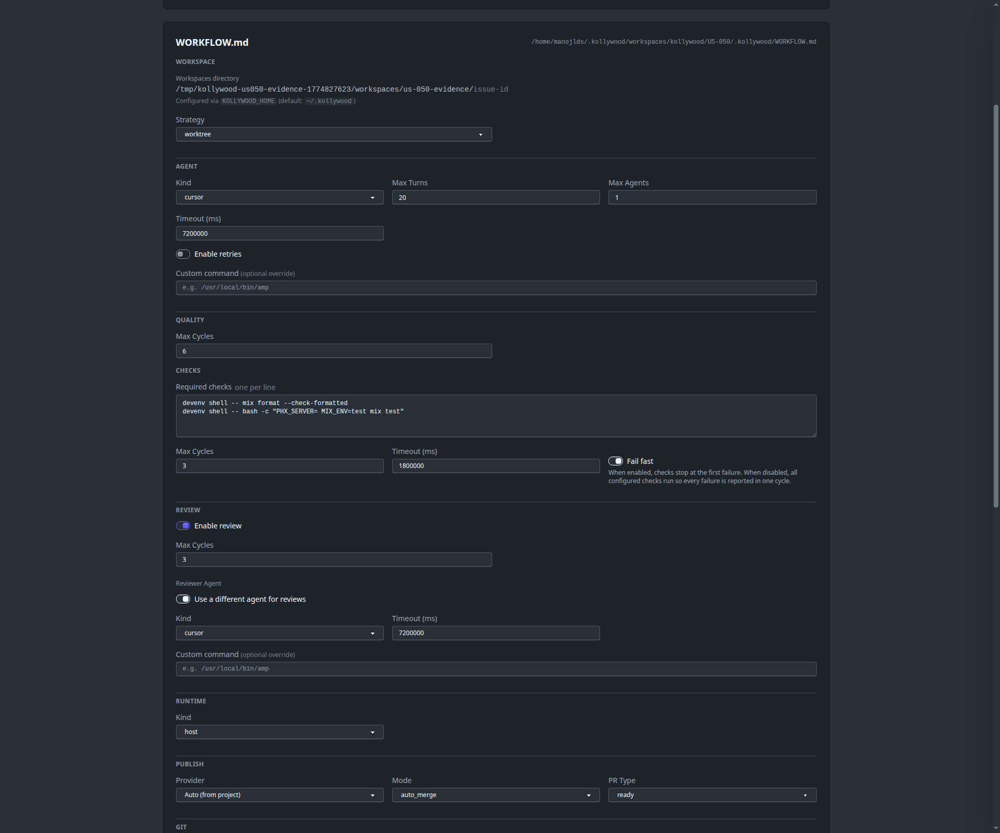

# US-050 Testing Report: Fail-Fast Toggle Behavior

Date: 2026-03-30

## Scope

Validate that `quality.checks.fail_fast` behavior is clear and correctly applied in runner execution and project settings UI.

## Verification Results

- `quality.checks.fail_fast` is wired to runner behavior:
  - `test/kollywood/agent_runner_test.exs` includes:
    - `fail-fast checks stop after the first failing command`
    - `disabled fail-fast checks report every failing command in one cycle`
- Project settings UI includes helper text:
  - `test/kollywood_web/live/dashboard_live_test.exs` asserts:
    - `"When enabled, checks stop at the first failure."`
    - regex coverage for:
      - `"When disabled, all configured checks run ..."`
      - `"... every failure is reported in one cycle."`

## Commands Run

- `devenv shell -- mix format --check-formatted` (pass)
- `devenv shell -- bash -c "PHX_SERVER= MIX_ENV=test mix test"` (rerun required due transient SQLite lock)
- `devenv shell -- bash -c "KOLLYWOOD_HOME=/tmp/kollywood-us050-test-<timestamp> PHX_SERVER= MIX_ENV=test mix test"` (pass)

## UI Evidence

- Project settings page opened at `http://127.0.0.1:4100/projects/us-050-evidence/settings`
- Helper text confirmed via browser automation:
  - `When enabled, checks stop at the first failure. When disabled, all configured checks run so every failure is reported in one cycle.`
- Screenshot:
  - `test/artifacts/us-050/fail-fast-toggle.png`

